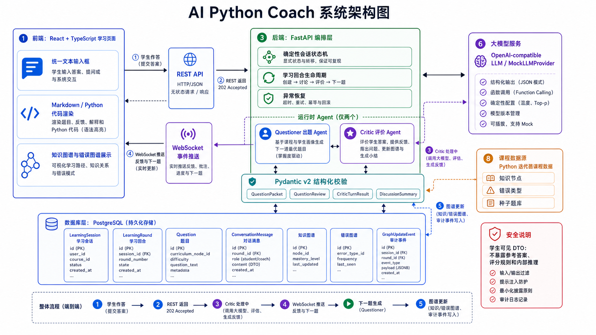

# PyCoach Lab

面向 Python 初学者的双 Agent AI 陪练 MVP。当前版本已跑通 Questioner 出题、Critic 审题与对话、候选题预生成、图谱更新、WebSocket 推送和 React 学习页面。

## 系统架构



## 仓库内 Skill

- [`chapter-adaptive-questioning`](skills/chapter-adaptive-questioning/SKILL.md)：章节自适应出题 Skill，用于根据章节核心知识点、用户掌握度和错误图谱生成 10 题练习蓝图，并约束题目质量、难度梯度和学生可见内容边界。

## 本地环境

项目基线为 Python 3.10.19、Node.js 20、PostgreSQL 16。

首次克隆后创建后端环境：

```bash
conda create -n langchain python=3.10.19
conda activate langchain
python -m pip install -r requirements.txt
```

本地已有 `langchain` 环境时，只需激活并安装或同步依赖：

```bash
conda activate langchain
python -m pip install -r requirements.txt
```

启动后端：

```bash
make api-dev
```

数据库迁移和课程种子导入：

```bash
cd services/api
alembic upgrade head
cd ../..
make seed
```

启动前端：

```bash
cd apps/web
npm ci
npm run dev
```

`requirements.txt` 固定后端和测试工具版本；`apps/web/package-lock.json` 固定前端依赖版本。

使用 OpenAI-compatible 模型时，在根目录 `.env` 配置：

```env
LLM_PROVIDER=openai_compatible
LLM_BASE_URL=https://your-provider.example/v1
LLM_API_KEY=your-api-key
LLM_MODEL=your-model
LLM_TIMEOUT_SECONDS=75
LLM_EXTRA_BODY=
```

阿里云百炼千问建议关闭思考模式以提高结构化 JSON 的稳定性：

```env
LLM_EXTRA_BODY={"enable_thinking":false}
```

API Key 只能写入已被 `.gitignore` 排除的 `.env`，不要写入 `.env.example`。

完整容器启动：

```bash
cp .env.example .env
docker compose up -d --build --wait
make smoke
```

容器启动时会自动执行 Alembic 迁移和幂等种子导入。`--wait` 会等待 PostgreSQL 和 API 健康检查通过。

Phase 2 图谱 API：

```text
GET /api/learners/demo_user/knowledge-graph
GET /api/learners/demo_user/error-graph
```

## 学习会话 API

创建会话：

```bash
curl -X POST http://localhost:8000/api/sessions \
  -H 'Content-Type: application/json' \
  -d '{"learner_id":"demo_user","module":"python_iterator"}'
```

提交学生消息会立即返回 `202 processing`：

```bash
curl -X POST http://localhost:8000/api/sessions/{session_id}/messages \
  -H 'Content-Type: application/json' \
  -d '{"content":"next(iterator)"}'
```

异步结果通过以下 WebSocket 推送：

```text
ws://localhost:8000/ws/sessions/{session_id}
```

刷新或重连后可恢复会话：

```text
GET /api/sessions/{session_id}
```

前端会把会话 ID 保存在浏览器 `localStorage` 中。页面刷新后会调用会话查询 API 恢复消息、当前题目和图谱；已失效的会话 ID 会自动替换为新会话。

学习页面只有一个统一文本输入框：

```text
Enter          发送
Shift + Enter  换行
```

中文输入法选字期间的 Enter 只确认候选字，不会提前发送消息。输入框保持固定的舒适高度，长内容在输入框内部滚动。

前端不会渲染参考答案、评分规则、掌握度小数、错误严重度或 provisional 图谱更新。
进入下一题时，页面只保留当前题及本题对话；历史回合仍保存在数据库中，但不会继续堆叠在学习页面。
Questioner 完整生成并通过校验后一次性展示题目；Critic 的学生可见 Markdown 通过 WebSocket 增量推送。完整模型 JSON 结束后仍必须通过 Pydantic Schema 校验才能持久化和推进状态机。
下一题采用后台候选题预生成：学生作答当前题时，Questioner 会先准备下一题；用户输入“下一题”后优先直接发布已准备好的题，上一题总结、图谱提交和下下题预热在后台继续完成。

## 测试

```bash
make test
make build-web
```

启动 Docker 后执行真实通信测试：

```bash
make smoke
make stream-smoke
```

实施状态和验收步骤见 [PLANS.md](PLANS.md)。

## 当前限制

- 课程仅覆盖 Python 可迭代对象、迭代器、`iter()`、`next()`、状态、耗尽和 `StopIteration`。
- 当前只有 `demo_user`，没有登录、注册或多用户权限。
- MVP 不执行学生代码，复杂代码答案由 Critic 直接理解和评价。
- 掌握度和错误严重度使用简单、可审计的固定增减规则。
- 候选题后台任务运行在单个 FastAPI 进程中；服务重启时未完成的内存任务不会继续执行。
- Questioner 仍是完整题目一次性展示；Critic 回复支持 WebSocket 增量输出。
- OpenAI-compatible Provider 已实现；真实模型质量、延迟和供应商兼容性仍需要按供应商单独验证。
- 第一版没有 Redis、Celery、Neo4j、代码沙箱、登录、支付或排行榜。
